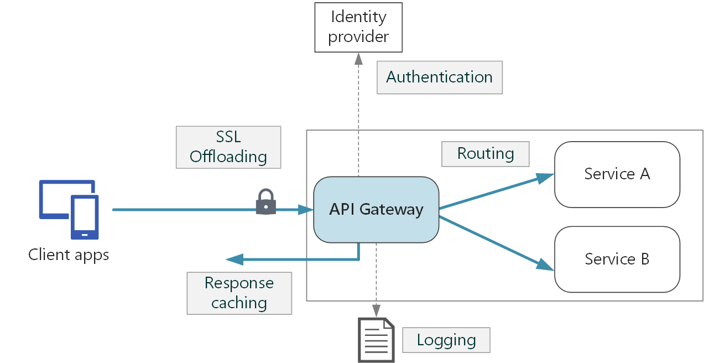
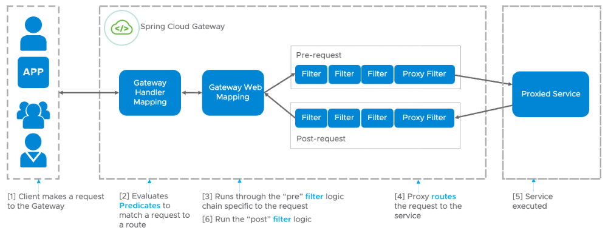

# 🍃 Spring Cloud Gateway

Spring Cloud Gateway is a starter project provided by Spring Cloud. It provides an API Gateway built on top of the Spring Ecosystem, including: Spring , Spring Boot, Spring WebFlux and Project Reactor.

## Architecture

Spring Cloud Gateway targets to offer a simple, yet effective way to route to APIs and provide cross cutting concerns to them such as: security, monitoring/metrics, and resiliency.




## Components



The main components of the spring cloud gateway are:

* Route: It is an important component in the spring cloud gateway. I consist of ID, destination URI, predicates, and filters.
* Predicates: It is the same as Java 8 function predicate. A Predicate simply evaluates the input against a condition defined by the Predicate and returns true if the condition is satisfied. Here the Predicate is used to match the HTTP requests. A route is matched if the Predicate returns true.
* Filter Chain: It is a series of filters applied to incoming requests and responses. It can be used for various purposes like authentication, requests or response transformation, and many more.

### Routes 

```yaml
routes:
        - id: catalog-route
          uri: ${CATALOG_SERVICE_URL:http://localhost:9000}/books
          predicates:
            - Path=/books/**
          filters:
            - name: CircuitBreaker # blocking a failure from cascading and affecting other components, protecting the rest of the system
              args:
                name: catalogCircuitBreaker
                fallbackUri: forward:/catalog-fallback
        - id: product-route
          uri: ${PRODUCT_SERVICE_URL:http://localhost:9001}/products
          predicates:
            - Path=/products/**
```

### Filters

```yaml
default-filters:
        - SaveSession  # Ensures the session data is saved before forwarding a request downstream
        - TokenRelay   # Enables the propagation of the Access Token (as an Authorization header) when calling a downstream service 
        - name: RequestRateLimiter # Rate liiting request managed by Redis
          args:
            redis-rate-limiter:
              replenishRate: 10
              burstCapacity: 20
              requestedTokens: 1
        - name: Retry
          args:
            retries: 3 # Maximum or retry attempts
            methods: GET # Retries only GET requests 
            series: SERVER_ERROR # Retries only when 5XX errors
            exceptions: java.io.IOException, java.util.concurrent.TimeoutException # Retries only when the given exceptions are thrown
            backoff:
              firstBackoff: 50ms
              maxBackOff: 500ms
              factor: 2
              basedOnPreviousValue: false
```
### Custom FallBack

```java
@Configuration
public class WebEndpoints {

	@Bean
	public RouterFunction<ServerResponse> routerFunction() {
		return RouterFunctions.route()
				.GET("/catalog-fallback", request ->
						ServerResponse.ok().body(Mono.just("This a fallback when catalog-service is down"), String.class))
				.GET("/product-fallback", request ->
				ServerResponse.ok().body(Mono.just("This a fallback when product-service is down"), String.class))
				.POST("/catalog-fallback", request ->
						ServerResponse.status(HttpStatus.SERVICE_UNAVAILABLE).build())
				.build();
	}	
}
```